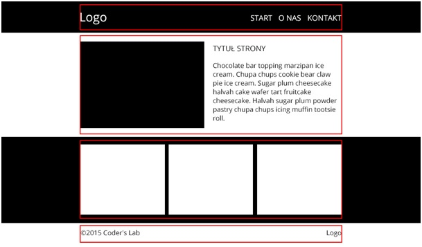

# CSS and HTML &ndash; workshop 

### Screenshot



**Tips**
* Podziel stronę odpowiednio (**section**, **header**, **footer**).
* Czarne tło pod **headerem** oraz pod trzema **boksami** powinny być rozciągnięte na ```100%``` szerokości strony.
* Linie czerwone przedstawione na powyższym przykładzie traktuj jako linie pomocnicze będące obramowaniem kontenera środkującego. Odpowiednio go nazwij np. ```main_width```.

## Technologies
> - HTML5
> - CSS
